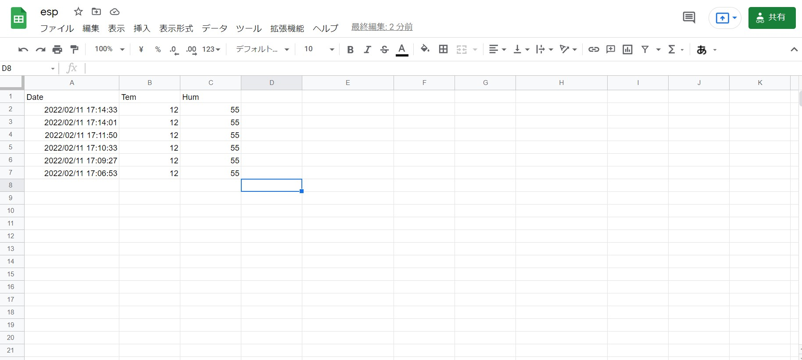
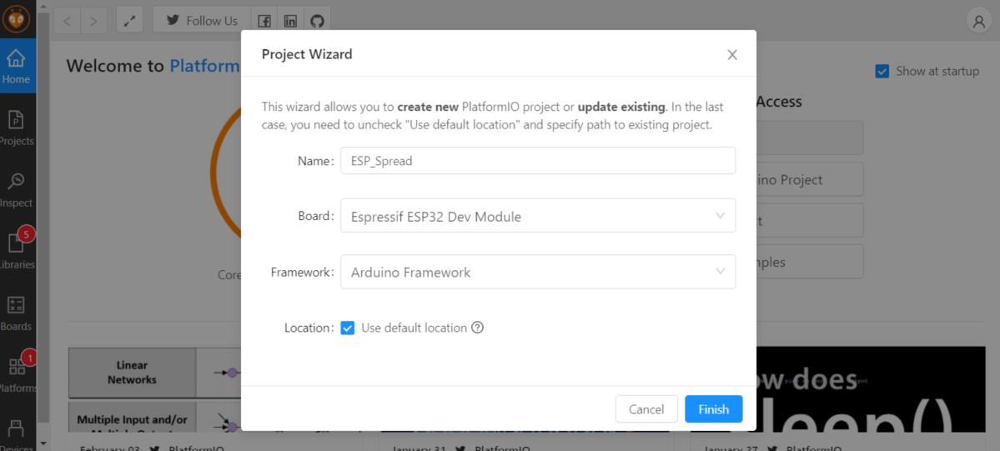
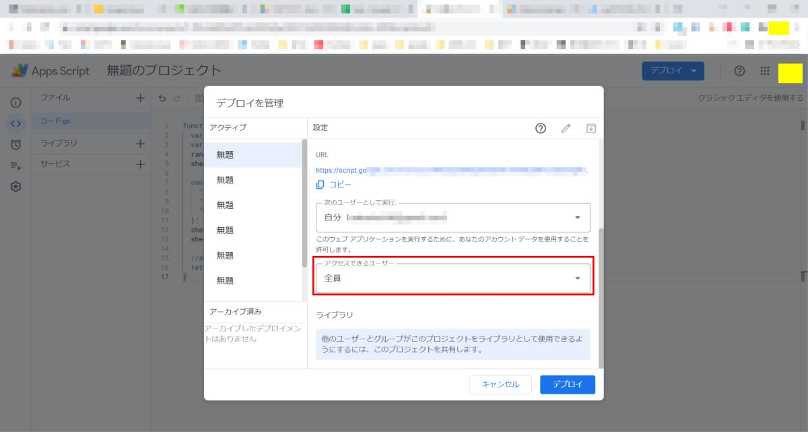

# ESP32_SpreadSheet

## 概要 (Overview)

ESP32でGoogle Spread Sheetを使うなるべくシンプルなテンプレ

書き込みと読み込みを外部サービスを使わずにESP32のみで

## 画面イメージ (ScreenShot)



## 動作要件 (Requirements)

C++ / ESP32 / Google spread sheet

## 技術的解説 (Technical explanation)

https://s51517765.hatenadiary.jp/entry/2022/02/xx


Wi-FiとGoogleの設定情報は<auth.h>に以下のように記載します
```
<auth.h>
extern char *ssid = "*******";      //Wi-Fi アクセスポイント
extern char *password = "*******";  //Wi-Fi パスポート
extern String host = "https://script.google.com/macros/s/*********/exec";   //スプレッドシートurl
```

VS Codeの設定



GASの設定




## 回路図 (Circuit diagram)

NA

## ライセンス (License)

This software is released under the MIT License, see LICENSE.
